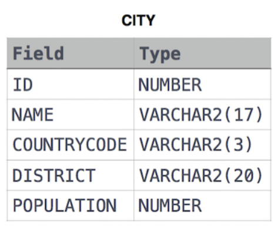
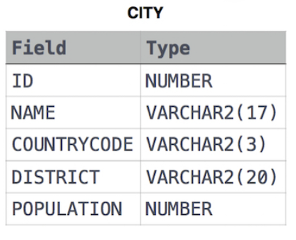

# HackerRank SQL Soruları Çözümleri

Bu repo, HackerRank platformundaki SQL sorularını çözmek için SQL sorgularını içermektedir. Her bir sorunun altında sorunun adı veya açıklaması, sorunun SQL sorgusu, çözümün açıklaması ve SQL kodu bulunmaktadır.

## İçindekiler

- [HackerRank SQL Soruları Çözümleri](#hackerrank-sql-soruları-çözümleri)
  - [İçindekiler](#i̇çindekiler)
  - [Soru 1: Revising the Select Query I](#soru-1-revising-the-select-query-i)
  - [Soru 2: Revising the Select Query II](#soru-2-revising-the-select-query-ii)

## Soru 1: Revising the Select Query I

**Soru:**

Query all columns for all American cities in the CITY table with populations larger than 100000. The CountryCode for America is USA.
The CITY table is described as follows: 



**Açıklama:**

Bu soruda **where** ve **and** komutunu kullanmalıyız. Sorguyu yazarken select **"*"** kullanarak ilgili satıra ait tüm sütunları getirebiliriz.


**SQL Kodu:**

```sql
SELECT * FROM CITY WHERE POPULATION > 100000 AND COUNTRYCODE = "USA"
```

## Soru 2: Revising the Select Query II

**Soru:**

Query the NAME field for all American cities in the CITY table with populations larger than 120000. The CountryCode for America is USA.

The CITY table is described as follows:



**Açıklama:**

Bu soruda **where** ve **and** komutunu kullanmalıyız. Sorguyu yazarken select **name** şeklinde belirterek ilgili satıra ait bilgilerden yalnızca name sütununu getirmesini sağlamış oluruz.


**SQL Kodu:**

```sql
SELECT NAME FROM CITY WHERE COUNTRYCODE = "USA" AND POPULATION > 120000
```


